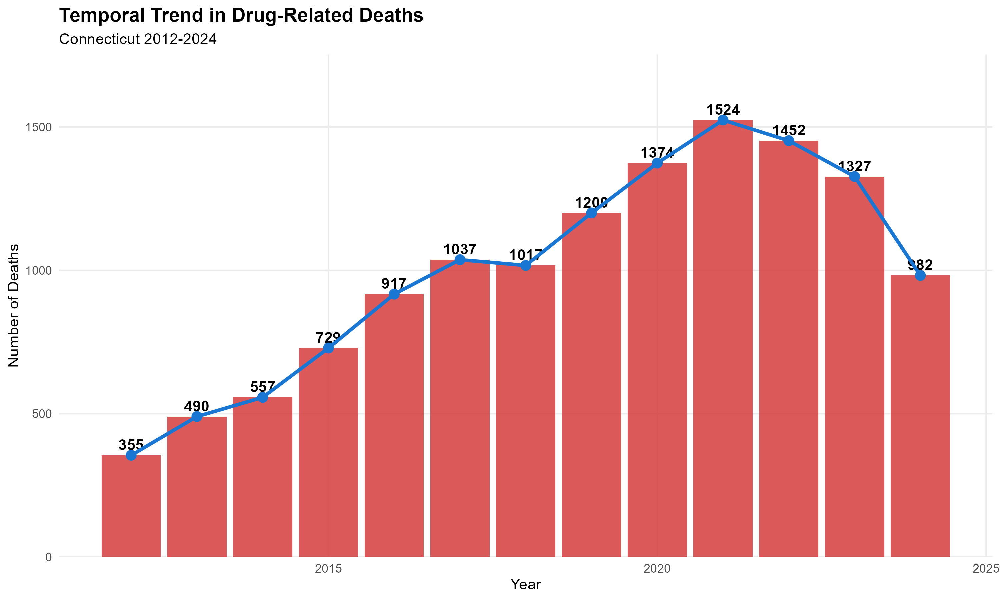
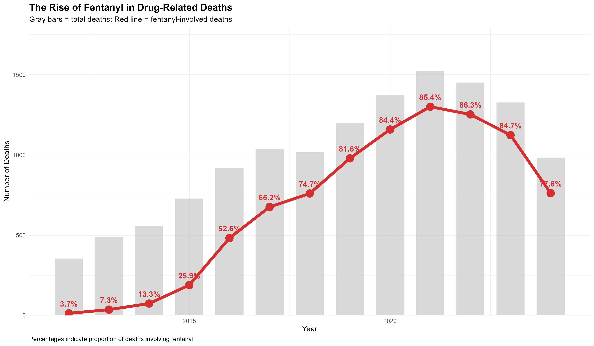
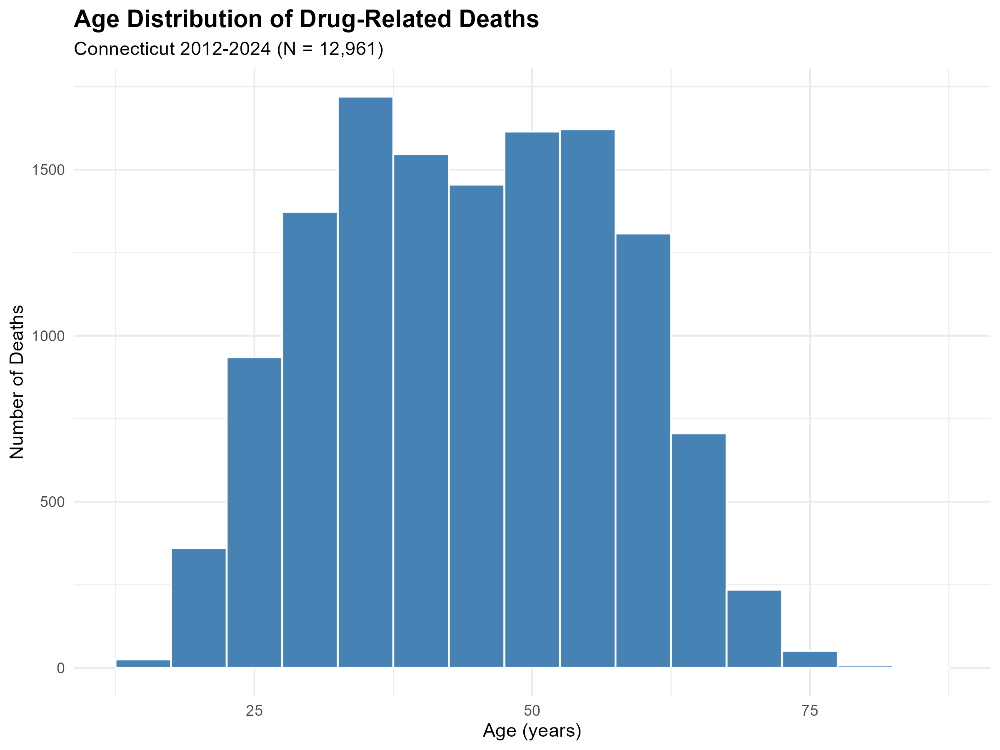

# Comprehensive Analysis of Accidental Drug-Related Deaths in Connecticut (2012-2024)

[](https://www.r-project.org/)
[](https://rmarkdown.rstudio.com/)

## 📊 Project Overview

This project presents a comprehensive epidemiological analysis of **12,961 accidental drug-related deaths** in Connecticut from 2012 to 2024. The analysis identifies critical trends in the opioid epidemic, characterizes demographic risk patterns, and quantifies the devastating impact of synthetic opioids (particularly fentanyl) on mortality rates.

## 🎯 Objectives

1. **Characterize** demographic and temporal patterns of drug-related deaths
2. **Quantify** the prevalence of specific substances, particularly opioids and fentanyl
3. **Identify** risk factors associated with overdose mortality
4. **Analyze** poly-drug use patterns and their temporal evolution
5. **Model** predictors of opioid involvement using multivariable regression

## 🔑 Key Findings

- **Fentanyl Crisis**: Fentanyl involvement increased from minimal levels in 2012 to 67.9% of deaths by 2024
- **Escalating Mortality**: 265% increase in annual deaths from 2012 to peak in 2021
- **Poly-Drug Epidemic**: Majority of overdose deaths involve multiple substances
- **Demographic Pattern**: 73.8% male, mean age 44.4 years, 83.4% White
- **Opioid Dominance**: 74.6% of deaths involved opioids

## 📁 Project Structure
```
├── Drug_Deaths_Analysis_Complete.Rmd    # Main R Markdown analysis
├── Drug_Deaths_Analysis_Complete.html   # Rendered HTML report
├── deaths_cleaned.csv                   # Cleaned dataset
├── deaths_cleaned.rds                   # R data format
├── outputs/                             # Generated outputs
│   ├── *.png                           # Visualizations
│   ├── *.csv                           # Tables
│   └── *.html                          # Formatted tables
└── README.md                            # This file
```

## 🛠️ Technologies Used

- **R** (version 4.4+)
- **tidyverse** - Data manipulation and visualization
- **lubridate** - Date handling
- **tableone** - Descriptive statistics
- **gtsummary** - Publication-quality tables
- **ggplot2** - Advanced visualizations
- **RMarkdown** - Reproducible reporting

## 📦 Installation & Usage

### Prerequisites
```r
# Install required packages
install.packages(c(
  "tidyverse", "lubridate", "tableone", 
  "gtsummary", "rmarkdown", "knitr"
))
```

### Running the Analysis

1. Clone this repository:
```bash
git clone https://github.com/YOUR_USERNAME/drug-deaths-analysis.git
cd drug-deaths-analysis
```

2. Open `Drug_Deaths_Analysis_Complete.Rmd` in RStudio

3. Click "Knit" or run:
```r
rmarkdown::render("Drug_Deaths_Analysis_Complete.Rmd")
```

## 📊 Data Source

- **Source**: [Data.gov - Accidental Drug Related Deaths 2012-2024](https://catalog.data.gov/dataset/accidental-drug-related-deaths-2012-2018)
- **Geographic Coverage**: Connecticut, USA
- **Variables**: Demographics, toxicology results, location data, circumstances of death
- **Sample Size**: 12,961 deaths (after cleaning)

## 📈 Sample Visualizations

### Temporal Trend in Deaths


### The Rise of Fentanyl


### Age Distribution


## 📝 Methodology

- **Data Cleaning**: Standardized demographics, converted drug variables to binary format
- **Descriptive Statistics**: Comprehensive demographic and substance involvement profiling
- **Temporal Analysis**: Year-over-year trends and monthly patterns
- **Statistical Modeling**: 
  - Logistic regression for opioid involvement predictors
  - Linear regression for age at death analysis
  - Chi-square tests for categorical associations
- **Visualization**: ggplot2-based publication-quality graphics

## 🚨 Public Health Implications

This analysis reveals urgent public health needs:

1. **Harm Reduction**: Widespread fentanyl test strips and naloxone distribution
2. **Treatment Expansion**: Increased access to medication-assisted treatment (MAT)
3. **Surveillance Enhancement**: Real-time drug supply monitoring
4. **Targeted Prevention**: Demographic-specific intervention programs
5. **Policy Reform**: Evidence-based drug policy and decriminalization

## 📄 License

This project is licensed under the MIT License - see the [LICENSE](LICENSE) file for details.

## 👤 Author

**Praisie Jemimah**
- Email: akkepogupraisie@gmail.com
- GitHub: Jem1917(https://github.com/Jem1917)
- LinkedIn: Praisie Jemimah

## 🙏 Acknowledgments

- Data provided by Connecticut Department of Public Health via Data.gov
- Analysis conducted using R and RMarkdown
- Inspired by the urgent need to address the opioid epidemic

## 📚 Citation

If you use this analysis or methodology, please cite:
```
Jemimah, P. (2026). Comprehensive Analysis of Accidental Drug-Related Deaths in Connecticut (2012-2024). 
GitHub repository: https://github.com/Jem1917/drug-deaths-analysis
```

## 📧 Contact

For questions, collaboration, or feedback, please reach out via email or open an issue on GitHub.

---

**Last Updated**: February 2026
**Status**: ✅ Complete


